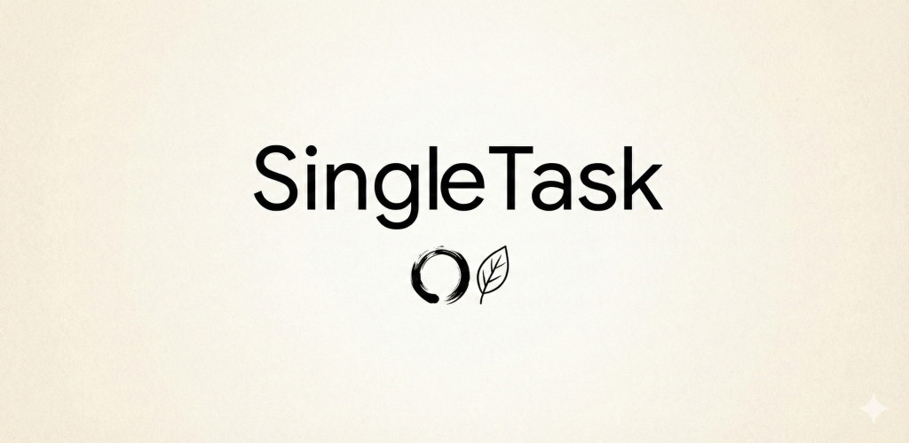

# SingleTask 🎯

> **Stop scattering your energy. Focus on one task, finish it, then move on.**

SingleTask is a minimalist productivity application built with **.NET MAUI** for Android. Designed to counter distraction, it enforces a "single tasking" workflow wrapped in a calming "Warm Paper" interface.

 

## ✨ Key Features

* **Single-Tasking Workflow:** Forces you to prioritize one item at a time. No complex sub-lists.
* **"Warm Paper" UI:** A custom-designed interface (`#fdfbf7`) to reduce eye strain and mimic physical stationery.
* **Sensory Feedback:** * 🔊 Satisfying audio cues upon completion.
    * 📳 Haptic feedback (vibrations) for tactile interactions.
* **Privacy First:** 100% Offline. Data is stored locally using SQLite. No accounts, no cloud.

## 🛠️ Tech Stack

* **Framework:** .NET 10.0 MAUI (Multi-platform App UI)
* **Language:** C#
* **Architecture:** MVVM (Model-View-ViewModel)
* **Data:** SQLite-net-pcl (Local Database)
* **Native Android:** * Foreground Services (Keep timer alive)
    * Broadcast Receivers
    * Android Assets (Audio/Haptics)
* **Testing:** xUnit (Unit Tests)

## 🚀 Getting Started

### Prerequisites
* .NET 10.0 SDK
* Visual Studio 2022 (with MAUI workload) OR VS Code with C# Dev Kit.
* Android Emulator or Physical Device (API 26+).

### Installation
1.  Clone the repository:
    ```bash
    git clone https://github.com/Elghat/SingleTask.git
    ```
2.  Open the solution `SingleTask.slnx` or the folder in VS Code.
3.  Restore dependencies:
    ```bash
    dotnet restore
    ```
4.  Run on Android:
    ```bash
    dotnet build -f net10.0-android -c Debug
    ```

## 📱 Screenshots

| Task List | Focus Mode | Celebration |
|:---:|:---:|:---:|
|  |  |  |

## 📄 Privacy Policy

This app respects your privacy. It does not collect, store, or transmit any personal data.
[Read the full Privacy Policy here](https://elghat.github.io/SingleTask/).

---
*Built with ❤️ and C# by [Me lol]*